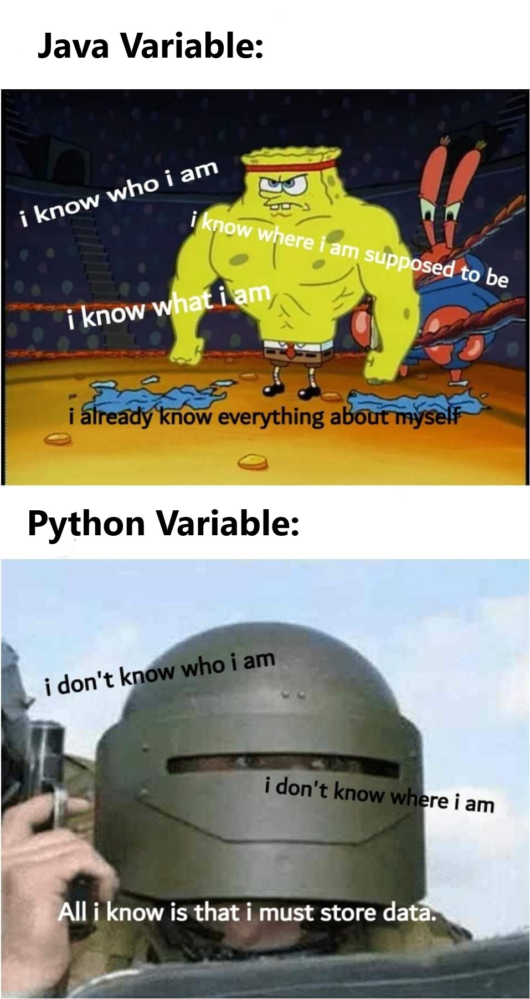

# Tutorial 1

## About me

Im Harrison Steyn (pronounced like theres a 'stain' on your shirt) and I'm a third year Computer Science and Aerospace Engineering student.

## About you

Lets go around the class and introduce ourselves (preferred name, degree).

Hopefully we have all seen the tutorial recordings.

## About the course

The course is split up into 3 modes: Lectures, Tutorials and Labs. 

These tutorials are mainly a time for a small amount of teaching from me but also a time for a QnA style interactive session.

You will want to get to know people in this class as there is a group assignment.

*insert Hannah Montana meme*

## About asking questions

There is no such thing as a stupid question. Dont be afraid to ask.

---

## Q1 - What is an `IDE` ?

Answer

Stands for `Integrated Development Environment`

It is an editor (Like gedit, nano, or vim) that also provides an extra layer of support for extra plugins such as debugging, code autocompletion etc.

---

## Q2a - What is a `class` and what is an `object` ?

Answer

A class is a blueprint that describes the behaviour and properties of a thing.

An object is an `instance` of a class.

## Q2b - Are the following a `class` or an `object` ?

### Human

Answer

A human is a `class`. Being a human defines certain /properties that all humans have, for example hair type, hair colour, name, age. 

It also defines behaviours, such as talking, moving etc that all objects of this class have. 

### Harrison

Answer

Harrison (me) is an `object` of the class Human. I have a defined hair colour (black), hair type (short), name (Harrison), and age (21).

### Animal

Answer

An animal is a `class` . It defines a blueprint of functionality and properties but has no defined values for them. For example an animal might have a genus name, number of legs, body structure etc.

### Dog

Answer

An animal is a `class`, but also a subclass of an animal.

---

## Q3 - What are the similarities and differences between C, Python, and Java?

### Paradigm

Answer

C: `procedural`

Python: `procedural`, `functional`, `object oriented`

Java: `procedural`, `object oriented`

### Indentation

Answer

C: Purely stylistic

Python: Required

Java: Purely stylistic

### Variables

Answer

C: Static, strongly typed.

Python: Dynamic, weakly typed.

Java: Static, strongly typed, polymorpic (talk more about this later)

### Access Control

Answer

C: Functions can only be accessed within the same file, unless prototyped in a .h file.

Python: No formal form of access control but convention is to put two underscores to indicate privacy.

Java: Strong access control (public, private, protected keywords)

### Memory management

Answer

C: Developer `malloc`'s and `free`'s memory

Python: Garbage collector controls memory.

Java: Garbage collector controls memory.

---

## Q4 - Write a program that sums integers from input.