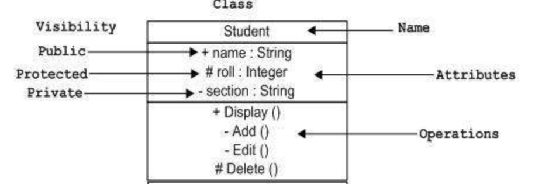

# Week 3 Tutorial

Today we will cover:
- Access Modifiers
- UML
- Quick intro to abstract classes and interfaces
- Kahoot?

 

---

## What are access modifiers and why do we use them?

 

---

## Lets investigate the java code that is given.

 

### What is UML? 

Unified Modelling Language - it is used to show the internal structure of our object oriented system.

Answer

 

### Lets turn the existing code into UML.

Answer

 

### What are associations, aggregations, and composition relationships?

They are all relationships betwen different classes

Association is the weakest, it implies one class uses the other but isnt strong enough a link to be one of the other relationships.

Aggregation implies that both classes can exist with or without one another.

Composition implies that the owned class cannot exist without the owning class.

Answer

 

### What are cardinalities/multiplicities?

Cardinalities are used to say how many of each object instances exist in the relationship.

Answer

 

### What is an abstract class? Can we update the given code to use abstract classes?

Just like a class is a blueprint for an object, an abstract class is a blueprint for a class

Answer

 

---

## What is an interface? How do they compare to abstract and concrete classes?

### Which have state?

| Interface     | Abstract Class  | Concrete Class  |
| ------------- |---------------| ----------------|
| No     | Yes | Yes |

Answer

 

### Which have functionality?

| Interface     | Abstract Class  | Concrete Class  |
| ------------- |---------------| ----------------|
| Yes     | Yes | Yes |

Answer

 

### Which are instantiable?

| Interface     | Abstract Class  | Concrete Class  |
| ------------- |---------------| ----------------|
| No     | No | Yes |

Answer

 

---

## Define the following terms:

### Coupling

Coupling is the degree to which one piece of code depends on the internal workings of another piece of code.

Answer

 

### Cohesion

Cohesion is the degree to which two bits of code/systems work together as one unit.

Answer

 

### Refactoring

Refactoring is the process of modifying the internal working of a system without changing the external behaviour. By definition this is easier to do with a lowly coupled system.

Answer

 

### Overloading

When two methods have the same name but different arguments that are passed in and thus different implementations.

Answer

 